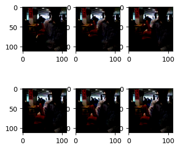
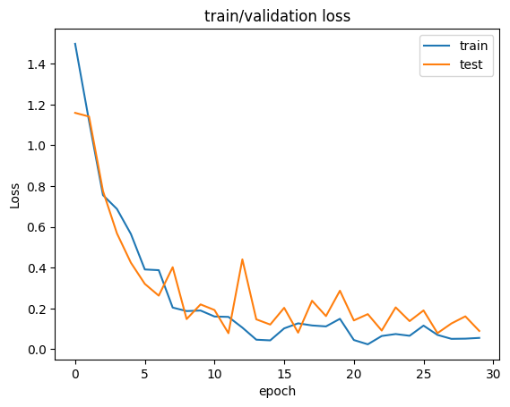

### Lib


```python
import random
import pandas as pd
import numpy as np
import os
import cv2

import torch
import torch.nn as nn
import torch.optim as optim
import torch.nn.functional as F
from torch.utils.data import Dataset, DataLoader
from torchvision import transforms
import torchsummary

import torchvision
import torchvision.models as models
import matplotlib.pyplot as plt

from sklearn.metrics import accuracy_score
from sklearn.metrics import f1_score
from sklearn.model_selection import train_test_split

import winsound as sd
```


### CUDA 설정


```python
# Device 설정
if torch.cuda.is_available():
    DEVICE = torch.device('cuda')
else:
    print('Using PyTorch version:', torch.__version__, ' Device:', DEVICE)
```


```python
data_info = pd.read_csv('../data/train.csv')
data_info.head(3)
```


<div>
<style scoped>
    .dataframe tbody tr th:only-of-type {
        vertical-align: middle;
    }

    .dataframe tbody tr th {
        vertical-align: top;
    }

    .dataframe thead th {
        text-align: right;
    }
</style>
<table border="1" class="dataframe">
  <thead>
    <tr style="text-align: right;">
      <th></th>
      <th>id</th>
      <th>path</th>
      <th>label</th>
    </tr>
  </thead>
  <tbody>
    <tr>
      <th>0</th>
      <td>TRAIN_000</td>
      <td>./train/TRAIN_000.mp4</td>
      <td>3</td>
    </tr>
    <tr>
      <th>1</th>
      <td>TRAIN_001</td>
      <td>./train/TRAIN_001.mp4</td>
      <td>0</td>
    </tr>
    <tr>
      <th>2</th>
      <td>TRAIN_002</td>
      <td>./train/TRAIN_002.mp4</td>
      <td>1</td>
    </tr>
  </tbody>
</table>
</div>


### Custom Dataset


```python
transform = transforms.Compose([
    transforms.Resize([120, 120]),
    transforms.RandomCrop(112),
    transforms.Normalize((0.5, 0.5, 0.5), (0.5, 0.5, 0.5))
    # transforms.Grayscale(num_output_channels=3)
    ])
```


```python
class CustomDataset(torch.utils.data.Dataset): 
        def __init__(self, info, transform):
            self.transform = transform
            self.root = '../data/'
            self.pathes = info['path'].values.tolist()
            
            self.y = torch.Tensor(info['label'].values)
            
        def __len__(self):
            return len(self.pathes)
        
        def mapping(self, label):
            if label == 0 : return label+1
            elif label == 1 : return label-1
            elif label == 2 : return label+1
            elif label == 3 : return label-1
            else : return label
        
        def __getitem__(self, idx):
            # n_frame, H, W, channel
            self.x = torchvision.io.read_video(self.root + self.pathes[idx][1:], start_pts=0, end_pts=1, pts_unit='sec')[0].permute(0, 3, 1, 2)
            self.x=self.x/255.0
            # Data Augmentation using (even frame, odd frame) / p = 0.5
            if random.randint(0, 9) >= 5:
                self.x = self.x[np.arange(0,30,3)]
            else :
                self.x = self.x[np.arange(0,30,3)+2]
                
            self.x = self.transform(self.x)
            trans_y = self.y[idx]
            
            # Data Augmentation using (VerticalFlip-class 0,1, HorigonFlip-class-2,3,4) / p = 0.5
            # if trans_y == 0 or trans_y == 1:
            #     if random.randint(0, 9) >= 5:
            #         self.x = transforms.RandomVerticalFlip(1)(self.x)
            #         trans_y = self.mapping(trans_y)
            
            if trans_y == 2 or trans_y == 3 :
                if random.randint(0, 9) >= 5:
                    self.x = transforms.RandomHorizontalFlip(1)(self.x)
                    trans_y = self.mapping(trans_y)
            
            return self.x, trans_y.to(torch.long)
```

### DataLoader


```python
total_dataset = CustomDataset(data_info, transform=transform)
train_dataset,test_dataset=train_test_split(total_dataset,train_size=0.7,stratify=torch.Tensor(data_info['label'].values))

train_loader = DataLoader(train_dataset, batch_size = 4, shuffle = True)
test_loader = DataLoader(test_dataset, batch_size = 4, shuffle = True)

print(len(train_dataset), len(test_dataset))
```

    427 183
    

### Data Visualization


```python
label_name =['volume_up', 'volume_down',
            'Jump_before', 'Jump_after',
            'stop']
```


```python
for i, (frames, label) in enumerate(train_loader):
    rows = 2; cols = 3
    fig, axes = plt.subplots(nrows=rows, ncols=cols, figsize=(4, 4))
    print(label_name[int(label[0])])
    axes[0][0].imshow(frames[0][0].permute(1,2,0))
    axes[0][1].imshow(frames[0][2].permute(1,2,0))
    axes[0][2].imshow(frames[0][4].permute(1,2,0))
    axes[1][0].imshow(frames[0][6].permute(1,2,0))
    axes[1][1].imshow(frames[0][8].permute(1,2,0))
    axes[1][2].imshow(frames[0][9].permute(1,2,0))
    break
```

    Clipping input data to the valid range for imshow with RGB data ([0..1] for floats or [0..255] for integers).
    Clipping input data to the valid range for imshow with RGB data ([0..1] for floats or [0..255] for integers).
    Clipping input data to the valid range for imshow with RGB data ([0..1] for floats or [0..255] for integers).
    Clipping input data to the valid range for imshow with RGB data ([0..1] for floats or [0..255] for integers).
    Clipping input data to the valid range for imshow with RGB data ([0..1] for floats or [0..255] for integers).
    Clipping input data to the valid range for imshow with RGB data ([0..1] for floats or [0..255] for integers).
    

    volume_up
    


    

    


### Modeling


```python
vgg16_pretrained = models.vgg11_bn(pretrained=True)
# resnet18_pretrained = models.resnet18(pretrained=True)
```

    C:\Users\user\anaconda3\envs\anomal\lib\site-packages\torchvision\models\_utils.py:208: UserWarning: The parameter 'pretrained' is deprecated since 0.13 and will be removed in 0.15, please use 'weights' instead.
      warnings.warn(
    C:\Users\user\anaconda3\envs\anomal\lib\site-packages\torchvision\models\_utils.py:223: UserWarning: Arguments other than a weight enum or `None` for 'weights' are deprecated since 0.13 and will be removed in 0.15. The current behavior is equivalent to passing `weights=VGG11_BN_Weights.IMAGENET1K_V1`. You can also use `weights=VGG11_BN_Weights.DEFAULT` to get the most up-to-date weights.
      warnings.warn(msg)
    Downloading: "https://download.pytorch.org/models/vgg11_bn-6002323d.pth" to C:\Users\user/.cache\torch\hub\checkpoints\vgg11_bn-6002323d.pth
    


      0%|          | 0.00/507M [00:00<?, ?B/s]


```python
vgg16_output_layer = 128
vgg16_pretrained.classifier[6] = nn.Linear(in_features=4096, out_features=vgg16_output_layer)
# resnet_output_layer = 128
# num_ftrs = resnet18_pretrained.fc.in_features
# resnet18_pretrained.fc = nn.Linear(num_ftrs, resnet_output_layer)
```


```python
class Attention_Boosted_Deep_Net(nn.Module):
    def __init__(self, input_dim, hidden_dim, n_layers, n_frames):
        super().__init__()
        
        self.CNN_2D = vgg16_pretrained
        
        self.Bidirectional_LSTM = nn.LSTM(input_size=input_dim, hidden_size=hidden_dim, num_layers=n_layers, batch_first=True, bidirectional=True)
        
        self.fc1 = nn.Linear(2*n_frames, n_frames)
        
        self.Dense = nn.Sequential(
            nn.Linear(10, 10),
        )
        
        self.fc2 = nn.Sequential(
            nn.Flatten(),
            nn.Linear(n_frames*hidden_dim*2, 256),
            nn.ReLU()
        )
        self.fc3 = nn.Linear(256, 5)
        
        self.Dropout = nn.Dropout(0.5)

    def forward(self, x):
        # Extract feature using 2D_CNN(VGG16), combine features along the temporal dimension
        x_ = [self.CNN_2D(x[:,i]) for i in range(x.size(1))]
        x = torch.stack(x_, dim=1)
        x, (h, c) = self.Bidirectional_LSTM(x)
        attention = F.softmax(self.Dense(x.permute(0, 2, 1)).permute(0, 2, 1), dim=1)
        x = torch.multiply(x, attention)
        x = self.fc2(x)
        out = self.fc3(self.Dropout(x))
        return out
```


```python
attention_bossted_deep_net = Attention_Boosted_Deep_Net(128, 256, 1, 10).to(DEVICE)
```

4, 10, 512

### Train


```python
cost = []
cost_val = []
F1_score_val = []

def train():
    num_epochs = 30
    lr = 1e-4
    model = attention_bossted_deep_net
    optim = torch.optim.Adam(model.parameters(), lr=lr)# weight_decay = 0.004


    for epoch in range(num_epochs):
        # model train
        
        label_list = torch.Tensor([])
        pred_list = torch.Tensor([])
        
        model.train()
        Accuracy = 0
        cost_ = 0
        
        for i, (images, labels) in enumerate(train_loader):
            input_ = images.float().to(DEVICE)
            label_ = labels.to(DEVICE)
            
            optim.zero_grad()
    
            out_ = model(input_)
            loss = F.cross_entropy(out_.to("cpu"), label_.to("cpu"))
            
            pred_ = torch.argmax(out_.to("cpu"), dim=1)
            
            label_list = torch.hstack((label_list, label_.to("cpu")))
            pred_list = torch.hstack((pred_list, pred_))
            
            loss.backward()
            optim.step()
            
            cost_ += loss
        
        # Score(cost, acc)
        Accuracy = accuracy_score(label_list, pred_list)
        cost_ = cost_/len(train_loader)
        cost.append(cost_.tolist())
        
#         # model evaluation
        
        label_list = torch.Tensor([])
        pred_list = torch.Tensor([])
        
        model.eval()
        with torch.no_grad():
            cost_val_ = 0
            Accuracy_val = 0
            
            for i, (images, labels) in enumerate(test_loader):
                input_ = images.float().to(DEVICE)
                label_ = labels.to(DEVICE)

                out_ = model(input_)
                pred_ = torch.argmax(out_.to("cpu"), dim=1)
                
                loss = F.cross_entropy(out_.to("cpu"), label_.to("cpu"))
                cost_val_ += loss
                
                label_list = torch.hstack((label_list, label_.to("cpu")))
                pred_list = torch.hstack((pred_list, pred_))
                
            # Score(cost, acc, f1)
            Accuracy_val = accuracy_score(label_list, pred_list)
            F1_score = f1_score(label_list, pred_list, average="macro")
            
            cost_val_ = cost_val_/len(test_loader)
            cost_val.append(cost_val_.tolist())
            F1_score_val.append(F1_score.tolist())
            
        if(epoch % 1 == 0 ):
            print("--------------------  Epoch : {:3d}/{:3d}  --------------------".format(epoch, num_epochs))
            print("[train] loss : {:2.4f} Acc : {:2.5f}%".format(cost_, Accuracy))
            print("[test ] loss : {:2.4f} Acc : {:2.5f}% F1 score : {:2.2f}%".format(cost_val_, Accuracy_val, F1_score))
            
        
        torch.save(model, ("./model/Attention_Boosted_Deep_Net_epoch{:d}.pt").format(epoch))
```


```python
train()
```

### Train/Test loss


```python
plt.title("train/validation loss")
plt.plot(cost)
plt.plot(cost_val)
plt.xlabel("epoch")
plt.ylabel("Loss")
plt.legend(['train', 'test'])
```


    <matplotlib.legend.Legend at 0x2530195afa0>


    

    


### Answer (Ensemble)


```python
from tqdm import tqdm
from itertools import combinations

quiz_info = pd.read_csv('../data/test.csv')
quiz_info.head(3)
transform_quiz = transforms.Compose([
    transforms.Resize([120, 120]),
    transforms.CenterCrop(112),
    transforms.Normalize((0.5, 0.5, 0.5), (0.5, 0.5, 0.5))
    # transforms.Grayscale(num_output_channels=3)
    ])

class QuizDataset(torch.utils.data.Dataset): 
        def __init__(self, info, transform):
            self.transform = transform
            self.root = '../data/'
            self.pathes = info['path'].values.tolist()
            
        def __len__(self):
            return len(self.pathes)
        
        def __getitem__(self, idx):
            # n_frame, H, W, channel
            self.x = torchvision.io.read_video(self.root + self.pathes[idx][1:], start_pts=0, end_pts=1, pts_unit='sec')[0].permute(0, 3, 1, 2)[np.arange(0,30,3)]
            self.x=self.x/255.0
            self.x = self.transform(self.x)
            return self.x
        
quiz_dataset = QuizDataset(quiz_info, transform_quiz)
quiz_loader = DataLoader(quiz_dataset, batch_size = 153, shuffle = False)

attention_bossted_deep_net1 = torch.load('./model_best/Attention_Boosted_Deep_Net_epoch13.pt').to(DEVICE).eval()
attention_bossted_deep_net2 = torch.load('./model_best/Attention_Boosted_Deep_Net_epoch18.pt').to(DEVICE).eval()
attention_bossted_deep_net3 = torch.load('./model_best/Attention_Boosted_Deep_Net_epoch22.pt').to(DEVICE).eval()
quiz_answer = torch.Tensor([])

for i, images in enumerate(quiz_loader):
    with torch.no_grad():
        input_ = images.float().to(DEVICE)

        out_1=torch.softmax(attention_bossted_deep_net1(input_),dim=1)
        out_2=torch.softmax(attention_bossted_deep_net2(input_),dim=1)
        out_3=torch.softmax(attention_bossted_deep_net3(input_),dim=1)

        out_= out_1+out_2+out_3
        out_ = torch.argmax(out_, dim=1)
        quiz_answer = torch.hstack([quiz_answer, out_.to('cpu')])
        
quiz_df = pd.DataFrame(quiz_answer, columns=['Answer'])
quiz_df.to_csv('./Answer.csv')
```


```python

```


```python

```


```python

```
