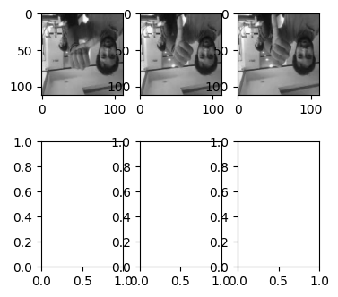
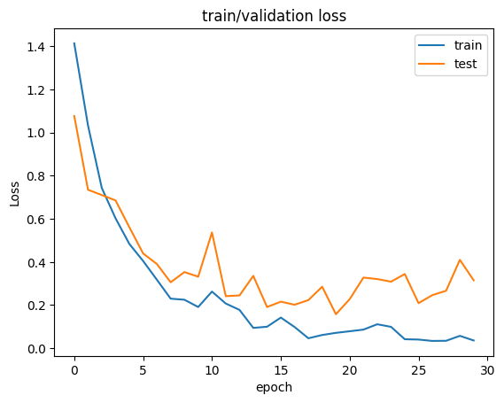

### Lib


```python
import random
import pandas as pd
import numpy as np
import os
import cv2

import torch
import torch.nn as nn
import torch.optim as optim
import torch.nn.functional as F
from torch.utils.data import Dataset, DataLoader
from torchvision import transforms
import torchsummary

import torchvision
import torchvision.models as models
import matplotlib.pyplot as plt

from sklearn.metrics import accuracy_score
from sklearn.metrics import f1_score
from sklearn.model_selection import train_test_split

import winsound as sd
```

### Set Device


```python
if torch.cuda.is_available():
    DEVICE = torch.device('cuda')
else:
    DEVICE = torch.device('cpu')
print('Using PyTorch version:', torch.__version__, ' Device:', DEVICE)
```

    Using PyTorch version: 1.12.1  Device: cuda
    

### Set Dataset, DataLoader


```python
data_info = pd.read_csv('../data/train.csv')
data_info.head(3)
```


<div>
<style scoped>
    .dataframe tbody tr th:only-of-type {
        vertical-align: middle;
    }

    .dataframe tbody tr th {
        vertical-align: top;
    }

    .dataframe thead th {
        text-align: right;
    }
</style>
<table border="1" class="dataframe">
  <thead>
    <tr style="text-align: right;">
      <th></th>
      <th>id</th>
      <th>path</th>
      <th>label</th>
    </tr>
  </thead>
  <tbody>
    <tr>
      <th>0</th>
      <td>TRAIN_000</td>
      <td>./train/TRAIN_000.mp4</td>
      <td>3</td>
    </tr>
    <tr>
      <th>1</th>
      <td>TRAIN_001</td>
      <td>./train/TRAIN_001.mp4</td>
      <td>0</td>
    </tr>
    <tr>
      <th>2</th>
      <td>TRAIN_002</td>
      <td>./train/TRAIN_002.mp4</td>
      <td>1</td>
    </tr>
  </tbody>
</table>
</div>


```python
transform = transforms.Compose([
    transforms.Resize([120, 120]),
    transforms.RandomCrop(112),
    transforms.Grayscale(num_output_channels=3)
    ])
```


```python
class CustomDataset(torch.utils.data.Dataset): 
        def __init__(self, info, transform):
            self.transform = transform
            self.root = '../data/'
            self.pathes = info['path'].values.tolist()
            
            self.y = torch.Tensor(info['label'].values)
            
        def __len__(self):
            return len(self.pathes)
        
        def mapping(self, label):
            if label == 0 : return label+1
            elif label == 1 : return label-1
            elif label == 2 : return label+1
            elif label == 3 : return label-1
            else : return label
        
        def __getitem__(self, idx):
            # n_frame, H, W, channel
            self.x = torchvision.io.read_video(self.root + self.pathes[idx][1:], start_pts=0, end_pts=1, pts_unit='sec')[0].permute(0, 3, 1, 2)
            
            # Data Augmentation using (even frame, odd frame) / p = 0.5
            if random.randint(0, 9) >= 5:
                self.x = self.x[np.array([0, 10, 20, 29])]
                # self.x = self.x[np.array([5, 15, 25])]
                
            else :
                self.x = self.x[np.array([0, 7, 22, 29])]
                # self.x = self.x[np.array([5, 15, 25])+2]
                
            self.x = self.transform(self.x)
            trans_y = self.y[idx]
            
            # Data Augmentation using (VerticalFlip-class 0,1, HorigonFlip-class-2,3,4) / p = 0.5
            if trans_y == 0 or trans_y == 1:
                if random.randint(0, 9) >= 5:
                    self.x = transforms.RandomVerticalFlip(1)(self.x)
                    trans_y = self.mapping(trans_y)
            
            if trans_y == 2 or trans_y == 3:
                if random.randint(0, 9) >= 5:
                    self.x = transforms.RandomHorizontalFlip(1)(self.x)
                    trans_y = self.mapping(trans_y)
                    
            return self.x, trans_y.to(torch.long)
```


```python
total_dataset = CustomDataset(data_info, transform=transform)

train_dataset, test_dataset = train_test_split(total_dataset, train_size=0.8, stratify = torch.Tensor(data_info['label'].values))

train_loader = DataLoader(train_dataset, batch_size = 4, shuffle = True)
test_loader = DataLoader(test_dataset, batch_size = 4, shuffle = True)
```


```python
# ## train test set의 클래스 별 분포
# train_data_class_counts = [0, 0, 0, 0, 0]
# for _, (_, label) in enumerate(train_dataset):
#     for i in range(5) : 
#         if label == i : train_data_class_counts[i] += 1

# test_data_class_counts = [0, 0, 0, 0, 0]
# for _, (_, label) in enumerate(test_dataset):
#     for i in range(5) : 
#         if label == i : test_data_class_counts[i] += 1
```


```python
# print(np.array(train_data_class_counts)/sum(train_data_class_counts)*100)
# print(np.array(test_data_class_counts)/sum(test_data_class_counts)*100)
```

### Data Visualization


```python
label_name =['volume_up', 'volume_down',
            'Jump_before', 'Jump_after',
            'stop']
```


```python
for i, (frames, label) in enumerate(train_loader):
    
    rows = 2; cols = 3
    fig, axes = plt.subplots(nrows=rows, ncols=cols, figsize=(4, 4))
    print(np.shape(frames))
    # print(np.shape(label))
    print(label_name[label[0]])
    axes[0][0].imshow(frames[0][0].permute(1,2,0))
    axes[0][1].imshow(frames[0][1].permute(1,2,0))
    axes[0][2].imshow(frames[0][2].permute(1,2,0))
    # axes[1][0].imshow(frames[0][3].permute(1,2,0))
    # axes[1][1].imshow(frames[0][4].permute(1,2,0))
    # axes[1][2].imshow(frames[0][5].permute(1,2,0))
    break
```

    torch.Size([4, 4, 3, 112, 112])
    volume_up
    


    

    


### Modeling


```python
resnet18_pretrained = models.resnet18(pretrained=True)
```

    C:\Users\user\anaconda3\envs\anomal\lib\site-packages\torchvision\models\_utils.py:208: UserWarning: The parameter 'pretrained' is deprecated since 0.13 and will be removed in 0.15, please use 'weights' instead.
      warnings.warn(
    C:\Users\user\anaconda3\envs\anomal\lib\site-packages\torchvision\models\_utils.py:223: UserWarning: Arguments other than a weight enum or `None` for 'weights' are deprecated since 0.13 and will be removed in 0.15. The current behavior is equivalent to passing `weights=ResNet18_Weights.IMAGENET1K_V1`. You can also use `weights=ResNet18_Weights.DEFAULT` to get the most up-to-date weights.
      warnings.warn(msg)
    


```python
renet_output_layer = 32
num_ftrs = resnet18_pretrained.fc.in_features
resnet18_pretrained.fc = nn.Linear(num_ftrs, renet_output_layer)
```


```python
class Resnet_Lstm_model(nn.Module):
    def __init__(self, input_size, hidden_size, num_layers, dropout=0):
        super().__init__()
        
        self.backbone = resnet18_pretrained
        self.lstm = nn.LSTM(input_size = input_size, hidden_size=hidden_size, num_layers=num_layers,batch_first=True, dropout=0)
        self.fc = nn.Linear(64, 5)
        
    def forward(self, x):
        
        # x_n shape : (batch, 64)
        x_ = [self.backbone(x[:,i]) for i in range(x.size(1))]
        
        # x : (batch, frame, 32)
        x = torch.stack(x_, dim=1)
        
        x, (_, _) = self.lstm(x) 
        x = x[:,-1,:] # output의 마지막 lstm layer의 출력 
        out = self.fc(x)
        
        return out
```


```python
resnet_lstm_model = Resnet_Lstm_model(input_size=32, hidden_size=64, num_layers=1).to(DEVICE)
```


```python
# batch, frame, channel, H, W
test_input = torch.Tensor(4, 3, 3, 224, 224)
with torch.no_grad():
    print(resnet_lstm_model(test_input.to(DEVICE)).size())
```

    torch.Size([4, 5])
    


```python
cost = []
cost_val = []
F1_score_val = []

def train():
    num_epochs = 30
    lr = 1e-4
    model = resnet_lstm_model
    optim = torch.optim.Adam(model.parameters(), lr=lr)# weight_decay = 0.004
    criterion = nn.CrossEntropyLoss()

    for epoch in range(num_epochs):
        # model train
        
        label_list = torch.Tensor([])
        pred_list = torch.Tensor([])
        
        model.train()
        Accuracy = 0
        cost_ = 0
        
        for i, (images, labels) in enumerate(train_loader):
            input_ = images.float().to(DEVICE)
            label_ = labels.to(DEVICE)
            
            optim.zero_grad()
    
            out_ = model(input_)
            # loss = criterion(out_.to("cpu"), label_.to("cpu"))
            loss = F.cross_entropy(out_.to("cpu"), label_.to("cpu"))
            
            pred_ = torch.argmax(out_.to("cpu"), dim=1)
            
            label_list = torch.hstack((label_list, label_.to("cpu")))
            pred_list = torch.hstack((pred_list, pred_))
            
            loss.backward()
            optim.step()
            
            cost_ += loss
        
        # Score(cost, acc)
        Accuracy = accuracy_score(label_list, pred_list)
        cost_ = cost_/len(train_loader)
        cost.append(cost_.tolist())
        
        # model evaluation
        
        label_list = torch.Tensor([])
        pred_list = torch.Tensor([])
        
        model.eval()
        with torch.no_grad():
            cost_val_ = 0
            Accuracy_val = 0
            
            for i, (images, labels) in enumerate(test_loader):
                input_ = images.float().to(DEVICE)
                label_ = labels.to(DEVICE)

                out_ = model(input_)
                pred_ = torch.argmax(out_.to("cpu"), dim=1)
                
                loss = F.cross_entropy(out_.to("cpu"), label_.to("cpu"))
                cost_val_ += loss
                
                label_list = torch.hstack((label_list, label_.to("cpu")))
                pred_list = torch.hstack((pred_list, pred_))
                
            # Score(cost, acc, f1)
            Accuracy_val = accuracy_score(label_list, pred_list)
            F1_score = f1_score(label_list, pred_list, average="macro")
            
            cost_val_ = cost_val_/len(test_loader)
            cost_val.append(cost_val_.tolist())
            F1_score_val.append(F1_score.tolist())
            
        if(epoch % 1 == 0 ):
            print("--------------------  Epoch : {:3d}/{:3d}  --------------------".format(epoch, num_epochs))
            print("[train] loss : {:2.4f} Acc : {:2.5f}%".format(cost_, Accuracy))
            print("[test ] loss : {:2.4f} Acc : {:2.5f}% F1 score : {:2.2f}%".format(cost_val_, Accuracy_val, F1_score))
            
        
        
        if(min(cost) == cost_) : torch.save(model, ("./model/resnet18_lstm_best_train_split90.pt"));
        if(min(cost_val) == cost_val_) : torch.save(model, ("./model/resnet18_lstm_best_test_split90.pt"));
        if(max(F1_score_val) == F1_score) : torch.save(model, ("./model/resnet18_lstm_best_f1score_split90.pt"));
```

### Train


```python
train()
sd.Beep(2000, 1000)
```

    --------------------  Epoch :   0/ 30  --------------------
    [train] loss : 1.4143 Acc : 0.44672%
    [test ] loss : 1.0773 Acc : 0.67213% F1 score : 0.68%
    --------------------  Epoch :   1/ 30  --------------------
    [train] loss : 1.0329 Acc : 0.68033%
    [test ] loss : 0.7351 Acc : 0.74590% F1 score : 0.73%
    --------------------  Epoch :   2/ 30  --------------------
    [train] loss : 0.7434 Acc : 0.76844%
    [test ] loss : 0.7105 Acc : 0.77049% F1 score : 0.77%
    --------------------  Epoch :   3/ 30  --------------------
    [train] loss : 0.6025 Acc : 0.81967%
    [test ] loss : 0.6857 Acc : 0.74590% F1 score : 0.75%
    --------------------  Epoch :   4/ 30  --------------------
    [train] loss : 0.4839 Acc : 0.88730%
    [test ] loss : 0.5614 Acc : 0.78689% F1 score : 0.77%
    --------------------  Epoch :   5/ 30  --------------------
    [train] loss : 0.4048 Acc : 0.88525%
    [test ] loss : 0.4397 Acc : 0.85246% F1 score : 0.85%
    --------------------  Epoch :   6/ 30  --------------------
    [train] loss : 0.3178 Acc : 0.91803%
    [test ] loss : 0.3907 Acc : 0.88525% F1 score : 0.89%
    --------------------  Epoch :   7/ 30  --------------------
    [train] loss : 0.2300 Acc : 0.95902%
    [test ] loss : 0.3059 Acc : 0.90984% F1 score : 0.91%
    --------------------  Epoch :   8/ 30  --------------------
    [train] loss : 0.2249 Acc : 0.94877%
    [test ] loss : 0.3533 Acc : 0.88525% F1 score : 0.88%
    --------------------  Epoch :   9/ 30  --------------------
    [train] loss : 0.1912 Acc : 0.95902%
    [test ] loss : 0.3318 Acc : 0.87705% F1 score : 0.88%
    --------------------  Epoch :  10/ 30  --------------------
    [train] loss : 0.2629 Acc : 0.92213%
    [test ] loss : 0.5369 Acc : 0.79508% F1 score : 0.80%
    --------------------  Epoch :  11/ 30  --------------------
    [train] loss : 0.2074 Acc : 0.94877%
    [test ] loss : 0.2416 Acc : 0.93443% F1 score : 0.94%
    --------------------  Epoch :  12/ 30  --------------------
    [train] loss : 0.1778 Acc : 0.95697%
    [test ] loss : 0.2448 Acc : 0.90984% F1 score : 0.91%
    --------------------  Epoch :  13/ 30  --------------------
    [train] loss : 0.0943 Acc : 0.98361%
    [test ] loss : 0.3355 Acc : 0.87705% F1 score : 0.88%
    --------------------  Epoch :  14/ 30  --------------------
    [train] loss : 0.0998 Acc : 0.98156%
    [test ] loss : 0.1912 Acc : 0.94262% F1 score : 0.94%
    --------------------  Epoch :  15/ 30  --------------------
    [train] loss : 0.1422 Acc : 0.97336%
    [test ] loss : 0.2159 Acc : 0.93443% F1 score : 0.94%
    --------------------  Epoch :  16/ 30  --------------------
    [train] loss : 0.0984 Acc : 0.97951%
    [test ] loss : 0.2018 Acc : 0.94262% F1 score : 0.94%
    --------------------  Epoch :  17/ 30  --------------------
    [train] loss : 0.0462 Acc : 0.99590%
    [test ] loss : 0.2232 Acc : 0.92623% F1 score : 0.93%
    --------------------  Epoch :  18/ 30  --------------------
    [train] loss : 0.0614 Acc : 0.98566%
    [test ] loss : 0.2853 Acc : 0.87705% F1 score : 0.88%
    --------------------  Epoch :  19/ 30  --------------------
    [train] loss : 0.0713 Acc : 0.98770%
    [test ] loss : 0.1578 Acc : 0.91803% F1 score : 0.92%
    --------------------  Epoch :  20/ 30  --------------------
    [train] loss : 0.0787 Acc : 0.98156%
    [test ] loss : 0.2277 Acc : 0.92623% F1 score : 0.92%
    --------------------  Epoch :  21/ 30  --------------------
    [train] loss : 0.0865 Acc : 0.97951%
    [test ] loss : 0.3278 Acc : 0.86066% F1 score : 0.86%
    --------------------  Epoch :  22/ 30  --------------------
    [train] loss : 0.1112 Acc : 0.96516%
    [test ] loss : 0.3209 Acc : 0.90984% F1 score : 0.91%
    --------------------  Epoch :  23/ 30  --------------------
    [train] loss : 0.0993 Acc : 0.97541%
    [test ] loss : 0.3087 Acc : 0.87705% F1 score : 0.88%
    --------------------  Epoch :  24/ 30  --------------------
    [train] loss : 0.0417 Acc : 0.99180%
    [test ] loss : 0.3442 Acc : 0.86066% F1 score : 0.86%
    --------------------  Epoch :  25/ 30  --------------------
    [train] loss : 0.0403 Acc : 0.99180%
    [test ] loss : 0.2090 Acc : 0.93443% F1 score : 0.94%
    --------------------  Epoch :  26/ 30  --------------------
    [train] loss : 0.0339 Acc : 0.99180%
    [test ] loss : 0.2464 Acc : 0.90984% F1 score : 0.91%
    --------------------  Epoch :  27/ 30  --------------------
    [train] loss : 0.0345 Acc : 0.99590%
    [test ] loss : 0.2667 Acc : 0.90164% F1 score : 0.90%
    --------------------  Epoch :  28/ 30  --------------------
    [train] loss : 0.0574 Acc : 0.99180%
    [test ] loss : 0.4102 Acc : 0.87705% F1 score : 0.88%
    --------------------  Epoch :  29/ 30  --------------------
    [train] loss : 0.0361 Acc : 0.99590%
    [test ] loss : 0.3152 Acc : 0.90164% F1 score : 0.91%
    


```python
plt.title("train/validation loss")
plt.plot(cost)
plt.plot(cost_val)
plt.xlabel("epoch")
plt.ylabel("Loss")
plt.legend(['train', 'test'])
plt.show()
```


    

    


### Test


```python
resnet_lstm_model = torch.load('./model/resnet18_lstm_best_test_split90.pt').to(DEVICE)
```


```python
transform_quiz = transforms.Compose([
    transforms.Resize([120, 120]),
    transforms.CenterCrop(112),
    transforms.Grayscale(num_output_channels=3)
    ])
```


```python
class QuizDataset(torch.utils.data.Dataset): 
        def __init__(self, info, transform):
            self.transform = transform
            self.root = '../data/'
            self.pathes = info['path'].values.tolist()
            
        def __len__(self):
            return len(self.pathes)

        def __getitem__(self, idx):
            # n_frame, H, W, channel
            self.x = torchvision.io.read_video(self.root + self.pathes[idx][1:], start_pts=0, end_pts=1, pts_unit='sec')[0].permute(0, 3, 1, 2)
            self.x = self.transform(self.x[np.array([0, 10, 20, 29])])
            
            return self.x
```


```python
quiz_info = pd.read_csv('../data/test.csv')
quiz_info.head(3)
```


<div>
<style scoped>
    .dataframe tbody tr th:only-of-type {
        vertical-align: middle;
    }

    .dataframe tbody tr th {
        vertical-align: top;
    }

    .dataframe thead th {
        text-align: right;
    }
</style>
<table border="1" class="dataframe">
  <thead>
    <tr style="text-align: right;">
      <th></th>
      <th>id</th>
      <th>path</th>
    </tr>
  </thead>
  <tbody>
    <tr>
      <th>0</th>
      <td>TEST_000</td>
      <td>./test/TEST_000.mp4</td>
    </tr>
    <tr>
      <th>1</th>
      <td>TEST_001</td>
      <td>./test/TEST_001.mp4</td>
    </tr>
    <tr>
      <th>2</th>
      <td>TEST_002</td>
      <td>./test/TEST_002.mp4</td>
    </tr>
  </tbody>
</table>
</div>


```python
quiz_dataset = QuizDataset(quiz_info, transform_quiz)
quiz_loader = DataLoader(quiz_dataset, batch_size = 153, shuffle = False)
```


```python
quiz_answer = torch.Tensor([])

predict_score = []

for i, images in enumerate(quiz_loader):
    with torch.no_grad():
        input_ = images.float().to(DEVICE)

        out_ = resnet_lstm_model(input_)
        predict_score.append(F.softmax(out_.to('cpu'), dim=1).tolist())
        out_ = torch.argmax(out_, dim=1)
        quiz_answer = torch.hstack([quiz_answer, out_.to('cpu')])
```


```python
np.shape(predict_score)
```


    (1, 153, 5)


```python
quiz_df = pd.DataFrame(quiz_answer, columns=['Answer'])
quiz_df.to_csv('./Answer.csv')
```
